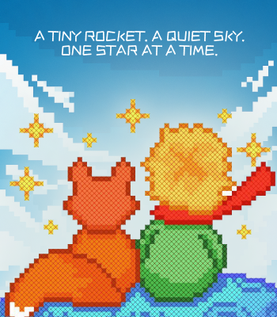
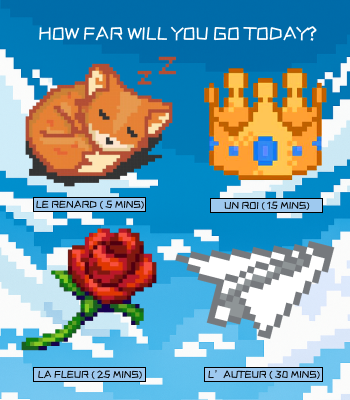
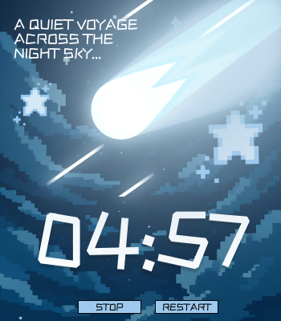
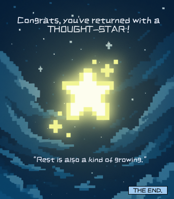

# 🌟 Little Universe Timer


[](https://electronjs.org/)
[](https://developer.mozilla.org/en-US/docs/Web/JavaScript)
[](https://developer.mozilla.org/en-US/docs/Web/HTML)
[](https://developer.mozilla.org/en-US/docs/Web/CSS)
[](https://nodejs.org/)

## About 
A peaceful meditation and focus timer app inspired by *The Little Prince*, featuring beautiful pixel art and calming soundscapes.

- **Beautiful Pixel Art Interface** - Four enchanting screens with Little Prince-inspired artwork
- **Multiple Timer Options** - Choose from 4 different session lengths:
  - 🦊 **Le Renard** - 5 minutes
  - 👑 **Un Roi** - 15 minutes  
  - 🌹 **La Fleur** - 25 minutes
  - ✈️ **L'Aviateur** - 30 minutes
- **Immersive Audio** - Continuous background music with completion sounds and gentle chimes
- **Inspiring Quotes** - Gain a quote in the form of a thought start after completeing your journey!
- **Smooth Animations** - Floating thought star and gentle hover effects
- **Complete Timer Controls** - Stop, resume, and restart functionality

## Interface

| Welcome Screen | Timer Selection | Active Timer | Completion |
|---|---|---|---|
|  |  |  |  |
 

## Perfect For

- Meditation sessions
- Pomodoro technique
- Focus work blocks  
- Mindful breathing
- Study sessions
- Creative breaks

## Setup

**Prerequisites:**
- Node.js (v16 or higher)
- npm

**Installation:**
```bash
# Clone the repository
git clone https://github.com/arooj-zehra/little-universe-timer.git

# Navigate to project directory
cd little-universe-timer

# Install dependencies
npm install

# Start the app in development mode
npm start
```

**Building for Distribution:**
```bash
# Build for Windows
npm run build-win

# Build for all platforms
npm run build

# Create portable version (no installer)
npm run pack
```

## Assets Structure

```
assets/
├── images/
│   ├── Screen 1.png          # Welcome background
│   ├── Screen 2.png          # Timer selection background
│   ├── Screen 3.png          # Timer countdown background
│   ├── Screen 4.png          # Completion background
│   ├── fox icon.png          # 5-minute timer icon
│   ├── crown icon.png        # 15-minute timer icon
│   ├── rose icon.png         # 25-minute timer icon
│   ├── paperplane icon.png   # 30-minute timer icon
│   ├── thought star.png      # Completion star
│   ├── comet.gif            # Animated comet
│   └── app_icon.png         # Application icon
└── sounds/
    ├── background loop.mp3   # Ambient background music
    ├── click sound.mp3       # UI interaction sound
    ├── time completed sound.mp3  # Timer completion
    └── chimes sound.mp3      # Success celebration
```

## Technical Details

- **Framework:** Electron.js
- **Supported Platforms:** Windows, macOS, Linux
- **Window Size:** 362x440 pixels (non-resizable)
- **Font:** ZCOOL KuaiLe
- **Audio Format:** MP3
- **Image Format:** PNG/GIF

## 🔧 Development Scripts

```bash
npm start          # Start development version
npm run dev        # Start with developer tools
npm run build      # Build for all platforms
npm run build-win  # Build Windows installer
npm run pack       # Create portable version
```

## Customization

### Adding New Quotes
Edit the `quotes` array in `src/renderer.js`:
```javascript
this.quotes = [
    "Your new inspiring quote here...",
    // ... existing quotes
];
```

### Modifying Timer Durations  
Update the `data-minutes` attributes in `src/index.html`:
```html
<div class="timer-icon" data-minutes="YOUR_MINUTES">
```

### Changing Audio Files
Replace files in `assets/sounds/` with the same filenames, or update paths in `src/index.html`

### Adjusting Visual Effects
Modify animations and styling in `src/style.css`

## Inspired By

This app draws inspiration from Antoine de Saint-Exupéry's timeless classic *The Little Prince*, incorporating themes of:
- Mindful observation ("One sees clearly only with the heart")
- The beauty of simple moments
- Journey and self-discovery
- The importance of taking time to appreciate life

*"It is the time you have wasted for your rose that makes your rose so important."* - The Little Prince

## 🎧 Project Soundtrack
*This track was on loop while working on this project.*

**[“Aibo (feat Bratty)” – Yves](https://open.spotify.com/track/0hvGU0lbDt8SWfEx797LuJ?si=3fde2136083f473d)**

Star this repository if you found it interesting! ⭐

**made with ❤️ by arooj**
